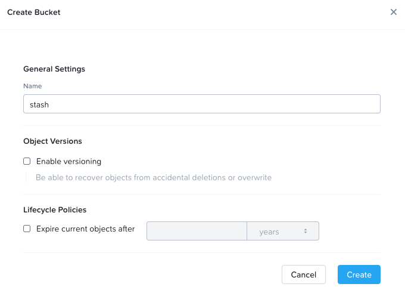
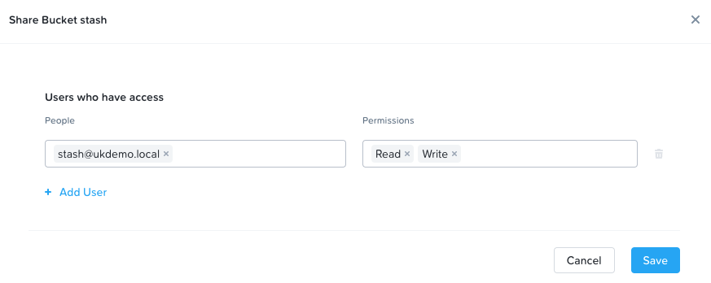

# Tutorial: Backup with Stash and Nutanix Objects

---
**NOTE**

* Tested with Stash release v0.11.6, Karbon 2.1.2 and Kubernetes 1.16.13

* Manifest will create `backup` namespace object

---

## Requirements

* Nutanix Karbon 2.1.2 or later

* Kubernetes cluster 1.16.13 or later

* [Helm 3 CLI](https://helm.sh/docs/intro/install/)

* Available a Nutanix Objects instance 1.0 or later

* Stash Community edition license. You can get one [here](https://github.com/stashed/docs/blob/master/docs/setup/install/community.md)

## Create Bucket

1. Connect to Prism Central

2. Open Objects

3. Create an access key

    

4. Create a bucket, I called it `stash`

    

5. Entitle user access

    

## Install Stash Operator

```shell
helm repo add appscode https://charts.appscode.com/stable/
helm repo update
helm install stash appscode/stash \
  --version v0.11.6 \
  --namespace backup \
  --set enableAnalytics=false \
  --set-file license=license.txt
```

Check Stash deployment

```shell
$ kubectl get deployment --namespace backup -l "app.kubernetes.io/name=stash,app.kubernetes.io/instance=stash"

NAME    READY   UP-TO-DATE   AVAILABLE   AGE
stash   1/1     1            1           26s

$ kubectl get crd -l app.kubernetes.io/name=stash
NAME                                      CREATED AT
backupblueprints.stash.appscode.com       2020-11-10T07:25:57Z
backupconfigurations.stash.appscode.com   2020-11-10T07:25:57Z
backupsessions.stash.appscode.com         2020-11-10T07:25:57Z
functions.stash.appscode.com              2020-11-10T07:25:58Z
recoveries.stash.appscode.com             2020-11-10T07:25:57Z
repositories.stash.appscode.com           2020-11-10T07:25:57Z
restics.stash.appscode.com                2020-11-10T07:25:57Z
restoresessions.stash.appscode.com        2020-11-10T07:25:57Z
tasks.stash.appscode.com                  2020-11-10T07:25:58Z
```

## Create Objects Secret

In this step you will create a Kubernetes secret with the configuration for Objects. You will need:

* The keys you created in the previous section

* Bucket name

* Objects URL

In the folder along with the other YAML files create the following file replacing the `bucket`, `endpoint`, `access_key` and `secret_key` with yours. This file will be used with Kubernetes Kustomize later

```shell
cat <<EOF >./objects.properties
type: s3
config:
  region: us-east-1
  bucket: YOUR_BUCKET_NAME_HERE
  endpoint: YOUR_ENDPOINT_URL_HERE
  access_key: YOUR_ACCESS_KEY_HERE
  secret_key: YOUR_SECRET_KEY_HERE
  http_config:
    insecure_skip_verify: true
EOF
```
